# ERD

## Project

SIMADU - Sistem Informasi Madrasah Diniyah / E-Raport

## Core Database Rules

- `students` tidak boleh memiliki `class_id` langsung.
- Riwayat kelas santri wajib disimpan di `student_class_enrollments`.
- Data santri lama tidak dihapus, cukup ubah status.
- Role internal menggunakan `guru_fan`, bukan `guru_mapel`.
- Label UI boleh menggunakan `Guru Fan/Mapel`.
- Nilai, absensi, sikap, raport, jadwal, dan jurnal harus terkait tahun ajaran serta semester.
- Raport final harus menyimpan snapshot agar raport lama tidak berubah ketika data master berubah.
- Teks Arab disimpan di kolom khusus seperti `arabic_name`.
- Detail jurnal tidak memakai satu tabel campuran. Gunakan:
  - `journal_memorizations`
  - `journal_kitab_legalizations`
  - `journal_scores`

---

## Main Entity Groups

### Authentication and Role

- users
- roles
- permissions
- model_has_roles
- model_has_permissions
- role_has_permissions

### User Profiles

- teachers
- guardians
- guardian_students

### Master Data

- students
- levels
- school_classes
- academic_years
- semesters
- subjects

### Academic Assignment

- student_class_enrollments
- homeroom_assignments
- teaching_assignments
- schedules

### Journal

- teacher_journals
- journal_memorizations
- journal_kitab_legalizations
- journal_scores

### Grading

- grade_components
- grades
- attitudes

### Attendance

- attendance_records
- attendance_summaries

### Report Card

- report_cards
- report_card_subjects
- report_exports

### Student Placement

- student_placements
- student_placement_items

### Audit

- activity_logs

---

## Mermaid ERD

```mermaid
erDiagram

    USERS {
        bigint id PK
        string name
        string username
        string email
        string phone
        string password
        string status
        timestamp email_verified_at
        timestamp phone_verified_at
        string remember_token
        timestamp last_login_at
        timestamp created_at
        timestamp updated_at
    }

    ROLES {
        bigint id PK
        string name
        string guard_name
        timestamp created_at
        timestamp updated_at
    }

    PERMISSIONS {
        bigint id PK
        string name
        string guard_name
        timestamp created_at
        timestamp updated_at
    }

    MODEL_HAS_ROLES {
        bigint role_id FK
        string model_type
        bigint model_id FK
    }

    MODEL_HAS_PERMISSIONS {
        bigint permission_id FK
        string model_type
        bigint model_id FK
    }

    ROLE_HAS_PERMISSIONS {
        bigint permission_id FK
        bigint role_id FK
    }

    TEACHERS {
        bigint id PK
        bigint user_id FK
        string teacher_code
        string name
        string gender
        string phone
        text address
        string signature_path
        string status
        timestamp created_at
        timestamp updated_at
    }

    GUARDIANS {
        bigint id PK
        bigint user_id FK
        string name
        string phone
        text address
        string status
        timestamp created_at
        timestamp updated_at
    }

    STUDENTS {
        bigint id PK
        string nis
        string name
        string gender
        string birth_place
        date birth_date
        text address
        string guardian_phone
        string status
        timestamp created_at
        timestamp updated_at
    }

    GUARDIAN_STUDENTS {
        bigint id PK
        bigint guardian_id FK
        bigint student_id FK
        string relationship
        timestamp created_at
        timestamp updated_at
    }

    LEVELS {
        bigint id PK
        string name
        string description
        int sort_order
        string status
        timestamp created_at
        timestamp updated_at
    }

    SCHOOL_CLASSES {
        bigint id PK
        bigint level_id FK
        string name
        string code
        int sort_order
        string status
        timestamp created_at
        timestamp updated_at
    }

    ACADEMIC_YEARS {
        bigint id PK
        string name
        date start_date
        date end_date
        boolean is_active
        timestamp created_at
        timestamp updated_at
    }

    SEMESTERS {
        bigint id PK
        bigint academic_year_id FK
        string name
        date start_date
        date end_date
        boolean is_active
        timestamp created_at
        timestamp updated_at
    }

    SUBJECTS {
        bigint id PK
        string name
        string arabic_name
        string code
        int sort_order
        string status
        timestamp created_at
        timestamp updated_at
    }

    STUDENT_CLASS_ENROLLMENTS {
        bigint id PK
        bigint student_id FK
        bigint school_class_id FK
        bigint academic_year_id FK
        bigint semester_id FK
        string enrollment_status
        boolean is_active
        bigint created_by FK
        timestamp created_at
        timestamp updated_at
    }

    HOMEROOM_ASSIGNMENTS {
        bigint id PK
        bigint teacher_id FK
        bigint school_class_id FK
        bigint academic_year_id FK
        bigint semester_id FK
        timestamp created_at
        timestamp updated_at
    }

    TEACHING_ASSIGNMENTS {
        bigint id PK
        bigint teacher_id FK
        bigint subject_id FK
        bigint school_class_id FK
        bigint academic_year_id FK
        bigint semester_id FK
        timestamp created_at
        timestamp updated_at
    }

    SCHEDULES {
        bigint id PK
        bigint teaching_assignment_id FK
        bigint academic_year_id FK
        bigint semester_id FK
        string day
        time start_time
        time end_time
        string room
        text description
        timestamp created_at
        timestamp updated_at
    }

    TEACHER_JOURNALS {
        bigint id PK
        bigint teacher_id FK
        bigint teaching_assignment_id FK
        bigint school_class_id FK
        bigint subject_id FK
        bigint academic_year_id FK
        bigint semester_id FK
        date journal_date
        string journal_type
        string title
        text description
        timestamp created_at
        timestamp updated_at
    }

    JOURNAL_MEMORIZATIONS {
        bigint id PK
        bigint teacher_journal_id FK
        bigint student_id FK
        string target
        string achievement
        string status
        text note
        timestamp created_at
        timestamp updated_at
    }

    JOURNAL_KITAB_LEGALIZATIONS {
        bigint id PK
        bigint teacher_journal_id FK
        bigint student_id FK
        string kitab_name
        string bab
        string page
        string legalization_status
        date legalized_at
        text note
        timestamp created_at
        timestamp updated_at
    }

    GRADE_COMPONENTS {
        bigint id PK
        bigint teaching_assignment_id FK
        string name
        string type
        decimal weight
        int sort_order
        timestamp created_at
        timestamp updated_at
    }

    JOURNAL_SCORES {
        bigint id PK
        bigint teacher_journal_id FK
        bigint student_id FK
        bigint grade_component_id FK
        string score_type
        decimal score
        text note
        timestamp created_at
        timestamp updated_at
    }

    GRADES {
        bigint id PK
        bigint student_id FK
        bigint grade_component_id FK
        bigint entered_by FK
        decimal score
        text note
        timestamp submitted_at
        timestamp created_at
        timestamp updated_at
    }

    ATTITUDES {
        bigint id PK
        bigint student_id FK
        bigint school_class_id FK
        bigint academic_year_id FK
        bigint semester_id FK
        bigint homeroom_teacher_id FK
        string akhlak
        string discipline
        string cleanliness
        text attitude_note
        timestamp created_at
        timestamp updated_at
    }

    ATTENDANCE_RECORDS {
        bigint id PK
        bigint student_id FK
        bigint school_class_id FK
        bigint academic_year_id FK
        bigint semester_id FK
        date attendance_date
        string status
        text note
        bigint recorded_by FK
        timestamp created_at
        timestamp updated_at
    }

    ATTENDANCE_SUMMARIES {
        bigint id PK
        bigint student_id FK
        bigint school_class_id FK
        bigint academic_year_id FK
        bigint semester_id FK
        int present_count
        int sick_count
        int permission_count
        int absent_count
        text note
        timestamp created_at
        timestamp updated_at
    }

    REPORT_CARDS {
        bigint id PK
        bigint student_id FK
        bigint school_class_id FK
        bigint academic_year_id FK
        bigint semester_id FK
        bigint homeroom_teacher_id FK
        string status
        string report_language
        string akhlak_snapshot
        string discipline_snapshot
        string cleanliness_snapshot
        text attitude_note_snapshot
        int present_count_snapshot
        int sick_count_snapshot
        int permission_count_snapshot
        int absent_count_snapshot
        text memorization_summary
        text kitab_summary
        text homeroom_note
        string pdf_path
        timestamp finalized_at
        timestamp published_at
        bigint finalized_by FK
        timestamp created_at
        timestamp updated_at
    }

    REPORT_CARD_SUBJECTS {
        bigint id PK
        bigint report_card_id FK
        bigint subject_id FK
        string subject_name
        string subject_arabic_name
        decimal final_score
        string predicate
        text description
        int sort_order
        timestamp created_at
        timestamp updated_at
    }

    REPORT_EXPORTS {
        bigint id PK
        bigint academic_year_id FK
        bigint semester_id FK
        bigint school_class_id FK
        bigint requested_by FK
        string export_type
        string status
        string file_path
        text error_message
        timestamp finished_at
        timestamp created_at
        timestamp updated_at
    }

    STUDENT_PLACEMENTS {
        bigint id PK
        bigint from_academic_year_id FK
        bigint from_semester_id FK
        bigint to_academic_year_id FK
        bigint to_semester_id FK
        bigint created_by FK
        string status
        text note
        timestamp processed_at
        timestamp created_at
        timestamp updated_at
    }

    STUDENT_PLACEMENT_ITEMS {
        bigint id PK
        bigint student_placement_id FK
        bigint student_id FK
        bigint from_class_id FK
        bigint to_class_id FK
        string placement_status
        string validation_status
        text validation_message
        timestamp created_at
        timestamp updated_at
    }

    ACTIVITY_LOGS {
        bigint id PK
        bigint user_id FK
        string module
        string action
        text description
        string ip_address
        text user_agent
        timestamp created_at
    }

    USERS ||--o{ MODEL_HAS_ROLES : has_role
    ROLES ||--o{ MODEL_HAS_ROLES : assigned_to

    USERS ||--o{ MODEL_HAS_PERMISSIONS : has_permission
    PERMISSIONS ||--o{ MODEL_HAS_PERMISSIONS : assigned_to

    ROLES ||--o{ ROLE_HAS_PERMISSIONS : has
    PERMISSIONS ||--o{ ROLE_HAS_PERMISSIONS : assigned_to

    USERS ||--o| TEACHERS : teacher_account
    USERS ||--o| GUARDIANS : guardian_account

    GUARDIANS ||--o{ GUARDIAN_STUDENTS : has
    STUDENTS ||--o{ GUARDIAN_STUDENTS : linked_to

    LEVELS ||--o{ SCHOOL_CLASSES : contains

    ACADEMIC_YEARS ||--o{ SEMESTERS : has

    STUDENTS ||--o{ STUDENT_CLASS_ENROLLMENTS : enrolled_in
    SCHOOL_CLASSES ||--o{ STUDENT_CLASS_ENROLLMENTS : contains
    ACADEMIC_YEARS ||--o{ STUDENT_CLASS_ENROLLMENTS : used_in
    SEMESTERS ||--o{ STUDENT_CLASS_ENROLLMENTS : used_in
    USERS ||--o{ STUDENT_CLASS_ENROLLMENTS : created_by

    TEACHERS ||--o{ HOMEROOM_ASSIGNMENTS : becomes
    SCHOOL_CLASSES ||--o{ HOMEROOM_ASSIGNMENTS : has
    ACADEMIC_YEARS ||--o{ HOMEROOM_ASSIGNMENTS : used_in
    SEMESTERS ||--o{ HOMEROOM_ASSIGNMENTS : used_in

    TEACHERS ||--o{ TEACHING_ASSIGNMENTS : teaches
    SUBJECTS ||--o{ TEACHING_ASSIGNMENTS : taught_as
    SCHOOL_CLASSES ||--o{ TEACHING_ASSIGNMENTS : taught_in
    ACADEMIC_YEARS ||--o{ TEACHING_ASSIGNMENTS : used_in
    SEMESTERS ||--o{ TEACHING_ASSIGNMENTS : used_in

    TEACHING_ASSIGNMENTS ||--o{ SCHEDULES : scheduled_as
    ACADEMIC_YEARS ||--o{ SCHEDULES : used_in
    SEMESTERS ||--o{ SCHEDULES : used_in

    TEACHERS ||--o{ TEACHER_JOURNALS : writes
    TEACHING_ASSIGNMENTS ||--o{ TEACHER_JOURNALS : based_on
    SCHOOL_CLASSES ||--o{ TEACHER_JOURNALS : for_class
    SUBJECTS ||--o{ TEACHER_JOURNALS : for_subject
    ACADEMIC_YEARS ||--o{ TEACHER_JOURNALS : used_in
    SEMESTERS ||--o{ TEACHER_JOURNALS : used_in

    TEACHER_JOURNALS ||--o{ JOURNAL_MEMORIZATIONS : has
    STUDENTS ||--o{ JOURNAL_MEMORIZATIONS : recorded_for

    TEACHER_JOURNALS ||--o{ JOURNAL_KITAB_LEGALIZATIONS : has
    STUDENTS ||--o{ JOURNAL_KITAB_LEGALIZATIONS : recorded_for

    TEACHING_ASSIGNMENTS ||--o{ GRADE_COMPONENTS : has

    TEACHER_JOURNALS ||--o{ JOURNAL_SCORES : has
    STUDENTS ||--o{ JOURNAL_SCORES : recorded_for
    GRADE_COMPONENTS ||--o{ JOURNAL_SCORES : uses

    STUDENTS ||--o{ GRADES : receives
    GRADE_COMPONENTS ||--o{ GRADES : component_of
    USERS ||--o{ GRADES : entered_by

    STUDENTS ||--o{ ATTITUDES : has
    SCHOOL_CLASSES ||--o{ ATTITUDES : in_class
    ACADEMIC_YEARS ||--o{ ATTITUDES : used_in
    SEMESTERS ||--o{ ATTITUDES : used_in
    TEACHERS ||--o{ ATTITUDES : filled_by

    STUDENTS ||--o{ ATTENDANCE_RECORDS : has
    SCHOOL_CLASSES ||--o{ ATTENDANCE_RECORDS : in_class
    ACADEMIC_YEARS ||--o{ ATTENDANCE_RECORDS : used_in
    SEMESTERS ||--o{ ATTENDANCE_RECORDS : used_in
    USERS ||--o{ ATTENDANCE_RECORDS : recorded_by

    STUDENTS ||--o{ ATTENDANCE_SUMMARIES : has
    SCHOOL_CLASSES ||--o{ ATTENDANCE_SUMMARIES : in_class
    ACADEMIC_YEARS ||--o{ ATTENDANCE_SUMMARIES : used_in
    SEMESTERS ||--o{ ATTENDANCE_SUMMARIES : used_in

    STUDENTS ||--o{ REPORT_CARDS : has
    SCHOOL_CLASSES ||--o{ REPORT_CARDS : for_class
    ACADEMIC_YEARS ||--o{ REPORT_CARDS : used_in
    SEMESTERS ||--o{ REPORT_CARDS : used_in
    TEACHERS ||--o{ REPORT_CARDS : signed_by
    USERS ||--o{ REPORT_CARDS : finalized_by

    REPORT_CARDS ||--o{ REPORT_CARD_SUBJECTS : contains
    SUBJECTS ||--o{ REPORT_CARD_SUBJECTS : snapshot_of

    ACADEMIC_YEARS ||--o{ REPORT_EXPORTS : used_in
    SEMESTERS ||--o{ REPORT_EXPORTS : used_in
    SCHOOL_CLASSES ||--o{ REPORT_EXPORTS : exported_for
    USERS ||--o{ REPORT_EXPORTS : requested_by

    ACADEMIC_YEARS ||--o{ STUDENT_PLACEMENTS : from_year
    SEMESTERS ||--o{ STUDENT_PLACEMENTS : from_semester
    ACADEMIC_YEARS ||--o{ STUDENT_PLACEMENTS : to_year
    SEMESTERS ||--o{ STUDENT_PLACEMENTS : to_semester
    USERS ||--o{ STUDENT_PLACEMENTS : created_by

    STUDENT_PLACEMENTS ||--o{ STUDENT_PLACEMENT_ITEMS : contains
    STUDENTS ||--o{ STUDENT_PLACEMENT_ITEMS : processed_student
    SCHOOL_CLASSES ||--o{ STUDENT_PLACEMENT_ITEMS : from_class
    SCHOOL_CLASSES ||--o{ STUDENT_PLACEMENT_ITEMS : to_class

    USERS ||--o{ ACTIVITY_LOGS : performs
```



---

## Important Table Notes

### `students`

Menyimpan data induk santri.

Jangan simpan kelas aktif langsung di tabel ini.

Kelas aktif santri diambil dari:

```text
student_class_enrollments
```

### `student_class_enrollments`

Menyimpan riwayat kelas santri per tahun ajaran dan semester.

Contoh riwayat:

```text
2025/2026 - Ganjil - Ibtida'iyah 1
2025/2026 - Genap - Ibtida'iyah 1
2026/2027 - Ganjil - Ibtida'iyah 2
```

### `homeroom_assignments`

Menyimpan data wali kelas.

Tabel ini menjawab:

```text
Guru siapa menjadi wali kelas untuk kelas apa pada tahun ajaran dan semester apa?
```

### `teaching_assignments`

Menyimpan data guru fan.

Tabel ini menjawab:

```text
Guru siapa mengajar fan/mapel apa di kelas apa pada tahun ajaran dan semester apa?
```

### `teacher_journals`

Menyimpan header jurnal guru.

Detail jurnal dipisah ke:

```text
journal_memorizations
journal_kitab_legalizations
journal_scores
```

### `report_cards`

Menyimpan snapshot raport final.

Snapshot diperlukan agar raport lama tidak berubah ketika data master seperti nama fan/mapel, sikap, absensi, atau format berubah.

### `report_card_subjects`

Menyimpan snapshot nilai fan/mapel di dalam raport.

Field seperti `subject_name` dan `subject_arabic_name` sengaja disimpan agar data raport lama tetap stabil.

---

## Unique Constraints

Recommended unique constraints:

```text
users.username
users.email
students.nis
teachers.teacher_code

guardian_students:
unique(guardian_id, student_id)

semesters:
unique(academic_year_id, name)

student_class_enrollments:
unique(student_id, academic_year_id, semester_id)

homeroom_assignments:
unique(school_class_id, academic_year_id, semester_id)

teaching_assignments:
unique(teacher_id, subject_id, school_class_id, academic_year_id, semester_id)

schedules:
unique(teaching_assignment_id, day, start_time, end_time)

grade_components:
unique(teaching_assignment_id, name)

grades:
unique(student_id, grade_component_id)

journal_scores:
unique(teacher_journal_id, student_id, grade_component_id)

attitudes:
unique(student_id, academic_year_id, semester_id)

attendance_records:
unique(student_id, attendance_date)

attendance_summaries:
unique(student_id, academic_year_id, semester_id)

report_cards:
unique(student_id, academic_year_id, semester_id)

report_card_subjects:
unique(report_card_id, subject_id)
```

---

## Index Recommendations

Recommended indexes:

```text
students.nis
students.name
students.status

teachers.teacher_code
teachers.name
teachers.status

student_class_enrollments.student_id
student_class_enrollments.school_class_id
student_class_enrollments.academic_year_id
student_class_enrollments.semester_id

teaching_assignments.teacher_id
teaching_assignments.subject_id
teaching_assignments.school_class_id
teaching_assignments.academic_year_id
teaching_assignments.semester_id

teacher_journals.teacher_id
teacher_journals.school_class_id
teacher_journals.subject_id
teacher_journals.journal_date

grades.student_id
grades.grade_component_id

report_cards.student_id
report_cards.school_class_id
report_cards.academic_year_id
report_cards.semester_id

attendance_records.student_id
attendance_records.attendance_date
```

---

## MVP Table Priority

Untuk MVP awal, tabel yang diprioritaskan:

```text
users
roles
permissions
model_has_roles
role_has_permissions
teachers
students
levels
school_classes
academic_years
semesters
subjects
student_class_enrollments
homeroom_assignments
teaching_assignments
grade_components
grades
attitudes
attendance_summaries
report_cards
report_card_subjects
```

Tabel yang bisa masuk fase lanjutan:

```text
guardians
guardian_students
schedules
teacher_journals
journal_memorizations
journal_kitab_legalizations
journal_scores
attendance_records
report_exports
student_placements
student_placement_items
activity_logs
```